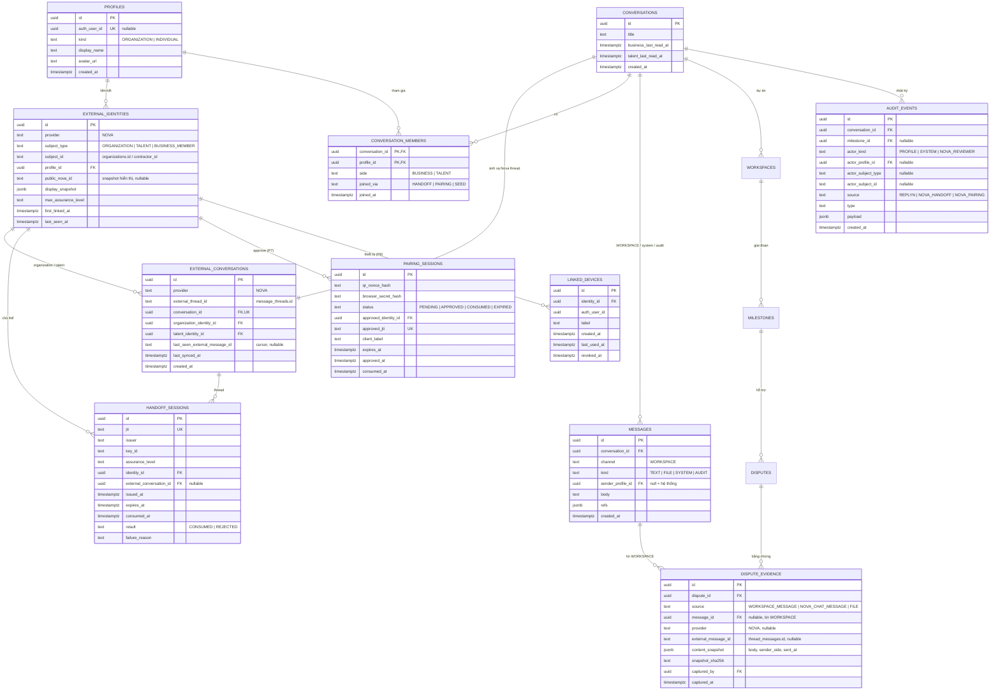

# Kế hoạch tích hợp Nova ↔ Replyn (Supabase) và ERD

Trạng thái: **thiết kế đã duyệt ngày 04/10/2026, chưa triển khai.** Chưa có migration, Edge Function, khóa ký hay
endpoint Nova nào được tạo. Bản nộp 05/10 vẫn chạy dữ liệu mock trong trình duyệt.

Nguồn: khảo sát read-only ba codebase ngày 04/10/2026:

- `replyn-web` — repo này, **là repo duy nhất nằm trong bài nộp**.
- `NIVEX-BUSINESS` — Nova Business web và backend Nova dùng chung.
- `NIVEX-FLUTTER` — Nova Mobile.

Hai codebase Nova chỉ được khảo sát để thiết kế contract; tài liệu này không mô tả thay đổi nào đã làm trong chúng.

---

## 1. Hiện trạng đã xác minh

| | Nova Business (web) | Nova Mobile (Flutter) |
|---|---|---|
| Backend | Spring Boot + PostgreSQL dùng chung (thư mục `backend` của NIVEX-BUSINESS, Flyway V1–V19) | Cùng backend |
| Gọi backend | Proxy server-side `/api/devnet/*` gắn `X-Nova-Demo-Key` | Gọi thẳng, `Authorization: Bearer` |
| Auth | **Chưa có.** Form đăng nhập giả lập, một organization gán cứng `00000000-0000-0000-0000-000000000001` | **Thật**: email/mật khẩu (PBKDF2) hoặc OTP, token opaque băm SHA-256, refresh xoay vòng, `flutter_secure_storage` |
| ID chủ thể | `organizations.id` (uuid) | `talent_profiles.contractor_id` (varchar 120, dạng `contractor-<uuid>`) |
| Conversation | `message_threads.id` (uuid), unique `(organization_id, contractor_id)` | Cùng ID |
| Message | `thread_messages.id` (uuid), `sender_type BUSINESS\|TALENT`, `sent_at/delivered_at/seen_at` timestamptz | Cùng |
| Realtime | Polling 8 s (tin), 2,5 s (typing) | Polling 8 s; thông báo qua bảng `notifications` (có `threadId`) |
| Deep link / QR | URL web, `?candidate=<threadId>` | Chưa có deep link, chưa có QR scanner (chỉ `qr_flutter` để tạo QR) |

Replyn hiện tại: chat + workspace chạy bằng reducer mock trong bộ nhớ; `/auth/nova` là prototype giao diện
(Nova ID/Nova Key và QR được mô phỏng, `src/lib/auth/mockNova.ts`).

---

## 2. Quyết định đã chốt

### 2.1 External identity

Khóa tổng hợp `(provider, subject_type, subject_id)`:

| Bên | provider | subject_type | subject_id |
|---|---|---|---|
| Business | `NOVA` | `ORGANIZATION` | `organizations.id` |
| Freelancer | `NOVA` | `TALENT` | `talent_profiles.contractor_id` |

- **Không** dùng `mobile_accounts.id` (đó là tài khoản đăng nhập, không phải chủ thể dùng trong chat/hồ sơ).
- `subject_id`: ID nội bộ ổn định, chỉ dùng để liên kết hệ thống. Kiểu `text` vì `contractor_id` là varchar.
- `public_nova_id`: mã dễ đọc để hiển thị (ví dụ `NVB-7K29Q`). **Không phải credential**, không bao giờ đủ để đăng nhập.
- Thiết kế tương lai phía Nova (chưa migration): cột `public_nova_id` unique cho `organizations` và
  `talent_profiles`. Replyn chỉ lưu bản snapshot để hiển thị.
- Khi Nova Business có tài khoản thành viên (P1), thêm `subject_type = BUSINESS_MEMBER`; organization vẫn là chủ thể
  của conversation.

### 2.2 Nguồn dữ liệu CHAT

- **Nova là source of truth duy nhất** cho tin nhắn CHAT. Replyn không sao chép `thread_messages` vào Supabase.
- View CHAT đọc và gửi qua **Nova CHAT connector** (P6). View WORKSPACE lưu trong Supabase.
- `external_conversations` ánh xạ `message_threads.id → conversations.id` (1:1).
- Giao diện vẫn là **một cuộc trò chuyện, hai view** (CHAT / WORKSPACE), icon bìa còng chuyển view.
- Tin Nova được chọn làm bằng chứng phải được **snapshot** vào `dispute_evidence.content_snapshot`, không phụ thuộc
  tin gốc còn tồn tại hay bị sửa.
- Được lưu cursor/metadata đồng bộ (ví dụ `last_seen_external_message_id`), không lưu bản sao đầy đủ.
- Trước khi có connector: CHAT dùng seed và ghi rõ là mock.

### 2.3 Mức tin cậy (assurance level)

Nova Business chưa có auth, nên handoff từ Business **không chứng minh danh tính người dùng**.

| assurance_level | Nguồn | Ý nghĩa |
|---|---|---|
| `DEMO_ORGANIZATION` | Business web hiện tại (organization gán cứng) | Chỉ chứng minh request đi qua backend Nova; ai có URL Business đều tạo được. Chỉ dùng cho demo. |
| `AUTHENTICATED_TALENT` | Nova Mobile, Bearer session thật | Chủ thể TALENT đã đăng nhập Nova. |
| `AUTHENTICATED_BUSINESS_MEMBER` | Sau P1 | Thành viên doanh nghiệp đã đăng nhập; mới được coi là trusted. |

Quy tắc:

- **Không** dùng `X-Nova-Demo-Key` làm khóa ký handoff. Khóa ký là cặp khóa riêng (P2).
- **Không** gọi Nova ID / Nova Key hiện tại là auth production.
- Replyn ghi `assurance_level` vào `handoff_sessions` và `external_identities.max_assurance_level`. Hành động nhạy
  cảm (khóa điều khoản, ký quỹ mô phỏng, giải ngân) với identity `DEMO_ORGANIZATION` phải hiển thị nhãn demo.

### 2.4 Chiến lược đăng nhập Replyn

- **Business và Talent đăng nhập Replyn qua Nova**: signed handoff (mục 4.1) hoặc QR pairing (mục 4.5).
- Hai bên **không** phải tạo thêm email/password Replyn.
- Supabase Auth user của họ được **provision/link nội bộ** sau khi Nova xác minh (`external_identities.profile_id` →
  `profiles.auth_user_id`), không có bước đăng ký riêng.
- **Email/password Supabase chỉ dành cho Nova reviewer/admin** ở giai đoạn đầu, không phải luồng chính của hai bên.

Quyết định này thay cho câu hỏi còn mở trước đây về việc dùng email/password Supabase làm auth chính.

### 2.5 Ưu tiên

Handoff trước QR. QR scanner, linked devices và deep link mobile được hoãn.

---

## 3. ERD Replyn (Supabase) — thiết kế, chưa migration



Bảng nghiệp vụ đã duyệt trước đó giữ nguyên, không vẽ chi tiết ở đây: `proposals`, `workspaces`,
`terms_versions` (+ acceptances), `milestones`, `submissions`, `disputes`, `milestone_settlements`,
`idempotency_keys`.

### Ràng buộc chính

- `external_identities`: unique `(provider, subject_type, subject_id)`; check `provider = 'NOVA'`.
- `external_conversations`: unique `(provider, external_thread_id)` và unique `conversation_id` → đúng một
  conversation Replyn cho mỗi Nova thread; organization/talent identity phải đúng `subject_type`.
- `conversation_members`: unique `(conversation_id, side)` — mỗi phía một thành viên (Nova gửi tin ở cấp phía, không
  ở cấp người).
- `messages.channel`: check `channel = 'WORKSPACE'`. **Không có channel CHAT trong Supabase** (thay đổi so với kế
  hoạch trước, khi `messages.channel` gồm `CHAT | WORKSPACE`).
- `dispute_evidence`: check nhất quán nguồn — `NOVA_CHAT_MESSAGE` bắt buộc `provider`, `external_message_id`,
  `content_snapshot`; `WORKSPACE_MESSAGE` bắt buộc `message_id`. Evidence là append-only.
- `handoff_sessions.jti` unique → mỗi handoff chỉ dùng một lần. Không lưu token gốc.
- `pairing_sessions`: chỉ lưu hash của nonce và browser secret; `expires_at ≤ created + 120 s`.
- `audit_events`: append-only qua trigger (giữ quyết định cũ).
- Mọi thời điểm là `timestamptz`, trao đổi ISO-8601 UTC (khớp Nova).

### Phía Nova (tương lai, không migration ở Replyn)

- `organizations.public_nova_id`, `talent_profiles.public_nova_id`: unique, hiển thị được.
- `business_members` + session (P1).
- Khóa ký handoff (P2), endpoint tạo handoff, endpoint approve pairing (P7), quyền service cho connector (P6).

---

## 4. Integration contract (bản nháp cho P2–P5)

### 4.1 Signed handoff (Nova → Replyn)

1. Người dùng bấm **“Tạo hồ sơ công việc”** (Business: thanh tiêu đề hội thoại `MessagesView`; Mobile: AppBar
   `ApplicationThreadScreen`).
2. Client gọi Nova backend:
   - Business: `POST /api/devnet/replyn/handoffs` → proxy → `POST /api/v1/business/replyn/handoffs { threadId }`.
   - Mobile: `POST /api/v1/mobile/replyn/handoffs { threadId }` với Bearer.
3. Nova backend kiểm tra thread thuộc chủ thể và đang `ACCEPTED`, rồi ký token JWT (Ed25519, `alg: EdDSA`,
   header có `kid`). **Contract draft — chưa tạo khóa, chưa có endpoint.** Ví dụ payload:

   ```json
   {
     "iss": "https://api.nova.example",
     "aud": "replyn",
     "sub": "nova:TALENT:contractor-3f2a9c1e-0000-0000-0000-000000000000",
     "subject_type": "TALENT",
     "subject_id": "contractor-3f2a9c1e-0000-0000-0000-000000000000",
     "contract_version": "2026-10-handoff-v1",
     "jti": "6d1f0c2e-4b7a-4e7e-9c1d-2a5b8f3e7a10",
     "iat": 1791100800,
     "exp": 1791100920,
     "assurance_level": "AUTHENTICATED_TALENT",
     "thread": {
       "id": "<message_threads.id>",
       "organization_id": "<organizations.id>",
       "contractor_id": "<contractor_id>"
     },
     "display": { "organization_name": "…", "talent_name": "…" }
   }
   ```

   - `sub` là **chuỗi** dạng `nova:<subject_type>:<subject_id>`; `subject_type`, `subject_id` là claim riêng để
     Replyn không phải tách chuỗi.
   - `iss` là **issuer URL ổn định của Nova backend, lấy từ cấu hình** (không viết cứng, không dùng literal chung chung
     như `nova`). Replyn chỉ chấp nhận issuer có trong danh sách cấu hình, kèm public key theo `kid`.
   - `iat`, `exp` là **NumericDate** (số giây kể từ epoch, UTC); `exp - iat ≤ 120`.
   - `contract_version` cho phép đổi cấu trúc claim mà không phá client cũ; Replyn từ chối version không hỗ trợ.
   - Handoff từ Business web trước P1 mang `subject_type: "ORGANIZATION"` và
     `assurance_level: "DEMO_ORGANIZATION"`.

4. Client mở `https://<replyn>/auth/nova#handoff=<token>` (fragment: không vào log server hay Referer).

### 4.2 Replyn xác minh handoff (P3–P4)

Edge Function nhận token từ `/auth/nova`, rồi theo thứ tự:

1. Kiểm tra chữ ký theo `kid` (public key Nova cấu hình trong Supabase secrets), `iss` thuộc danh sách cấu hình,
   `aud`, `exp`/`iat` (cho phép lệch đồng hồ nhỏ), `contract_version` được hỗ trợ, và `sub` khớp
   `nova:<subject_type>:<subject_id>`.
2. `insert into handoff_sessions (jti, …)`; trùng `jti` → từ chối (chống replay).
3. Upsert **hai** `external_identities` (organization + talent) từ claim `thread`, không lấy từ query string.
4. Upsert **đúng một** `external_conversations` theo `(NOVA, thread.id)`; nếu mới thì tạo `conversations` và đủ hai
   `conversation_members`.
5. Ghi `audit_events` (`source = NOVA_HANDOFF`, kèm `assurance_level`).

### 4.3 Tạo session Replyn (P5)

Trước khi code: **đọc tài liệu Supabase hiện hành** (cách cấp session cho user từ phía server) và viết threat model
ngắn cho token exchange. Yêu cầu tối thiểu:

- Supabase Auth user được provision/link nội bộ cho identity (mục 2.4); người dùng không đặt mật khẩu Replyn.
- Session chỉ trả cho đúng trình duyệt đã gửi handoff, qua một mã trao đổi dùng một lần, hạn ngắn.
- Không đặt access/refresh token của Supabase trong URL.
- Identity `DEMO_ORGANIZATION` nhận session có cờ demo.

### 4.4 Nova CHAT connector (P6)

- Edge Function `nova-chat` đọc/gửi tin của thread đã ánh xạ, kiểm tra người gọi là `conversation_members` của
  conversation tương ứng.
- Cần credential service-to-service riêng cho Replyn phía Nova (không dùng `X-Nova-Demo-Key`).
- Câu hỏi mở cho P6: gửi tin “thay mặt” một phía — Nova phải chấp nhận chủ thể hành động do Replyn khẳng định; cần
  thiết kế quyền và audit trước khi làm.

### 4.5 QR pairing (P7, hoãn)

- Trình duyệt tạo pairing ở Replyn, nhận `pairingId + qrNonce`, tự giữ `browserSecret`.
- QR chỉ chứa `pairingId` và `qrNonce`. **Không có token dài hạn.**
- Mobile quét → màn xác nhận (hiện thiết bị xin đăng nhập) → `POST /api/v1/mobile/replyn/pairings/approve` (Bearer)
  → Nova backend ký xác nhận và gọi server–server sang Replyn.
- Trình duyệt chờ `APPROVED`, gọi consume kèm `browserSecret` → nhận session (cơ chế như 4.3).

---

## 5. Kế hoạch

### Trước 23:59 ngày 05/10 (bản nộp)

Không tích hợp backend thật. Không tạo migration, Edge Function, khóa Ed25519 hay endpoint Nova.

- [x] Hoàn thiện README: đủ 7 tuyên bố trung thực ở mục 6, liên kết tới tài liệu này.
- [x] Cập nhật kiến trúc và ERD (tài liệu này).
- [x] Sửa copy popover “Nova ID của tôi ở đâu?” → “Nova Business → Trang cá nhân → cạnh @handle”, kèm
      “Nova ID là tính năng đang được bổ sung vào hồ sơ doanh nghiệp.” (không đổi logic login).
- [x] Ghi rõ `/auth/nova` là prototype frontend (README và trang login).
- [ ] Giữ production mock ổn định; chuẩn bị video.

### Sau khi nộp

| Phase | Nội dung | Điều kiện trước khi bắt đầu |
|---|---|---|
| P1 | Thiết kế Business identity/auth (`business_members`, session) | — |
| P2 | Hợp đồng signed handoff, khóa Ed25519, `kid`, xoay khóa | P1 thiết kế xong để chốt `assurance_level` |
| P3 | Edge Function xác minh handoff | P2 |
| P4 | Ánh xạ external identity/conversation | P3 |
| P5 | Tạo Supabase session sau handoff | Đọc tài liệu Supabase hiện hành + threat model token exchange |
| P6 | Nova CHAT connector | P4; credential service-to-service phía Nova |
| P7 | QR pairing + mobile scanner | P5 |
| P8 | Linked devices, deep link mobile | P7 |

Vẫn áp dụng quy tắc cũ: branch riêng (`feat/supabase-integration`), migration là SQL có version trong
`supabase/migrations/`, chạy typecheck/lint/build/Playwright sau mỗi phase, hỏi trước mọi thao tác ghi database.

---

## 6. Nội dung trung thực cho README

- Nova Business và Nova Mobile dùng chung một backend Spring Boot/PostgreSQL.
- Nova Mobile có đăng nhập thật (email/OTP, token lưu an toàn trên thiết bị).
- Nova Business hiện là demo dưới một organization mẫu, **chưa có phiên đăng nhập người dùng doanh nghiệp**.
- Màn “Tiếp tục với Nova” của Replyn (Nova ID / Mã QR) là **prototype giao diện**: xác thực được mô phỏng trên
  trình duyệt, chưa gọi Nova hay Supabase.
- Tin nhắn Nova CHAT trong bản nộp là **dữ liệu seed**.
- Tích hợp Supabase, signed handoff và QR pairing là **kiến trúc tiếp theo** (tài liệu này), chưa triển khai.
- Ký quỹ, phí và giải ngân đều là **mô phỏng**; Replyn không giữ tiền thật.
